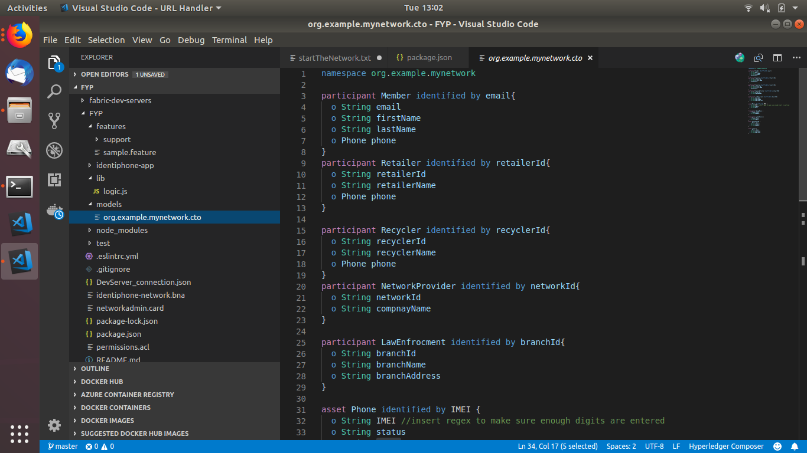
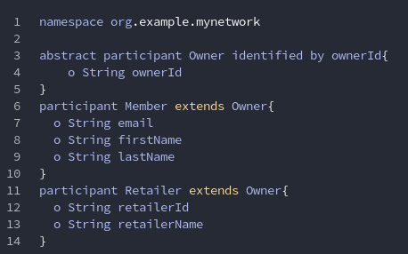
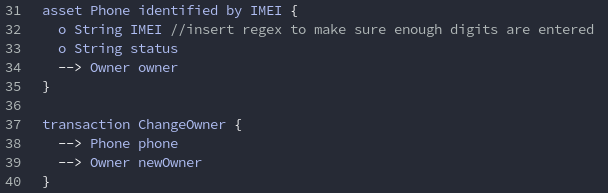
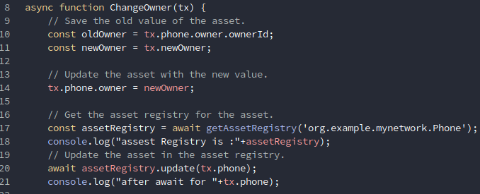

# Identiphone
A finaly year project by Aaron Byrne


Using the Hyperledger Fabric framework a blockchain network was built called “indentiphone-network”. The framework provides a lot of out of the box funtionality. I created the class definitions, assets, participants, events and transactions, seen the below figures. 
In this case the asset is a mobile phone. The participants are members of the public, phone retailers, phone recyclers, law enforcement, network providers and an administrator. T
he two transactions that exist on the network are changing of the owner and the marking a phone as stolen. These classes are defined in the Hyperledger composer modelling language file (.cto). 




To execute the transactions on the network the logic.js file is called. This file contains the JavaScript of how the owners name is changed to a new owner and how a phone can be marked as stolen.


These are the pieces of code that I have personally made/modified to suit my needs


To run the code you need to first download the fabric-dev-servers
````
mkdir ~/fabric-dev-servers && cd ~/fabric-dev-servers

curl -O https://raw.githubusercontent.com/hyperledger/composer-tools/master/packages/fabric-dev-servers/fabric-dev-servers.tar.gz
tar -xvf fabric-dev-servers.tar.gz
````

Now that the fabric dev servers are downloaded you will need to start the network a create a PeerAdmin Card
````
    cd ~/fabric-dev-servers
    export FABRIC_VERSION=hlfv11
    ./startFabric.sh
    ./createPeerAdminCard.sh
 ````
 
 
 The blockchain network should now be up and running
